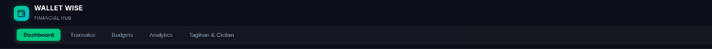

# Money Management

Aplikasi manajemen dan perencanaan keuangan personal berbasis web yang dibangun dengan arsitektur React, Vite, dan Supabase. Sistem ini dirancang untuk menangani pencatatan arus kas, alokasi anggaran berbasis siklus penggajian (*payday cycle*), pelacakan multi-rekening, kalkulasi bunga harian, serta otomasi tagihan dan cicilan.

---

## Preview Antarmuka

---

## Fitur Utama

### 1. Manajemen Transaksi & Aliran Dana
- Mendukung pencatatan pemasukan, pengeluaran, transfer antar-dompet, serta mutasi tabungan (setor/tarik).
- Deteksi dan validasi batas saldo per dompet secara *real-time* saat penginputan transaksi.
- Filter riwayat transaksi dinamis berdasarkan tipe mutasi dan kategori.

### 2. Multi-Wallet & Rekening
- Pengelolaan dompet tanpa batas (Kas Tunai, Rekening Bank, E-Wallet, dan platform investasi).
- Kalkulasi saldo aktual teragregasi secara otomatis dari riwayat transaksi debit/kredit.
- Integrasi kalkulator pendapatan bunga harian SeaBank yang otomatis tercatat ke riwayat mutasi.

### 3. Alokasi Anggaran & Siklus Penggajian (50-5-30-15 Rule)
- Kalkulasi alokasi finansial otomatis berdasarkan pendapatan bulanan:
  - 50% Kebutuhan Pokok
  - 5% Kebutuhan Bebas / Gaya Hidup
  - 30% Tabungan & Investasi
  - 15% Dana Darurat
- Penyesuaian rentang anggaran mengikuti tanggal siklus gajian (*Payday Date*) pengguna.
- Sistem peringatan dini (*alert threshold*) saat pengeluaran mendekati atau melampaui batas alokasi pos terkait.
- Pemantauan target tabungan dengan penentuan *deadline* dan pencatatan sumber dana mutasi.

### 4. Tagihan, Cicilan, dan Transaksi Berulang
- Pelacakan tagihan berkala dengan notifikasi jatuh tempo otomatis (H-5) pada antarmuka pengguna.
- Manajemen tenor cicilan beserta kalkulasi progres pelunasan dan sisa beban kewajiban.
- Otomasi eksekusi transaksi berulang (*daily*, *weekly*, *monthly*) saat autentikasi sesi pengguna.

### 5. Analisis & Visualisasi Data
- Visualisasi arus kas tahunan interaktif menggunakan grafik kombinasi (Bar & Line Chart) dengan selektor tahun.
- Analisis tren pengeluaran 14 hari terakhir dan perbandingan performa kas bulan berjalan terhadap periode sebelumnya.
- Kalkulasi proyeksi ketahanan dana (*runway estimate*) berdasarkan rerata *burn rate* harian.

### 6. Ekspor Data & Pelaporan
- Ekspor rekapitulasi data transaksi ke format CSV, JSON, dan dokumen PDF terstruktur.
- Fitur pengiriman salinan laporan berkas PDF langsung ke alamat email terdaftar.

### 7. Internasionalisasi & Multi-Mata Uang
- Deteksi otomatis preferensi bahasa mengikuti konfigurasi perangkat (*Auto Device Language: ID / EN*) dengan opsi pergantian manual.
- Dukungan konversi multi-mata uang (*IDR, USD, EUR, SGD*) dengan sistem *currency input formatter* terstandarisasi.

---

## Arsitektur & Tech Stack

| Komponen | Teknologi / Pustaka |
| --- | --- |
| Frontend Framework | React 18 (Vite Build Tool) |
| Database & Authentication | Supabase (PostgreSQL, GoTrue Auth, Row Level Security) |
| Visualisasi Data | Chart.js & react-chartjs-2 |
| Utilitas PDF | jsPDF & jspdf-autotable |
| Sanitasi Data & DOM | DOMPurify |
| Ikonografi | Lucide React |
| Layanan Email | FormSubmit Integration |

---

## Keamanan

- **Row Level Security (RLS):** Seluruh entitas tabel di PostgreSQL diisolasi penuh per `user_id`. Pengguna hanya memiliki hak akses baca dan tulis pada data milik sendiri.
- **Inactivity Timeout:** Sesi otomatis diakhiri jika tidak terdeteksi interaksi pengguna dalam interval waktu 1 menit untuk mencegah akses tidak sah pada perangkat bersama.
- **Client-side Sanitization:** Data string dari input pengguna diproses dan disanitasi sebelum dimasukkan ke dalam DOM maupun dokumen laporan.
